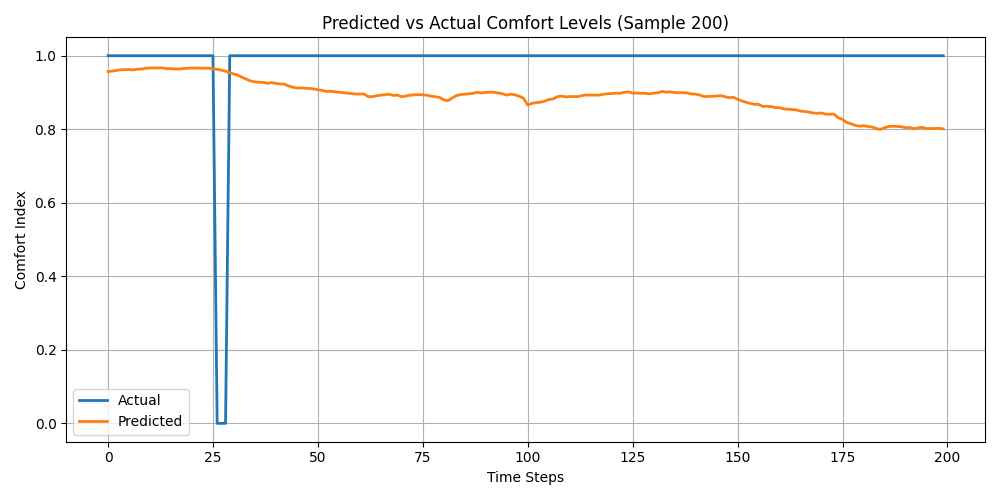

.

🌿 Project: EcoTherm — Sequential Hybrid GWOA + WOA Smart HVAC Energy Optimizer
🧭 Overview

EcoTherm is an AI-driven smart HVAC optimization system that predicts the optimal indoor comfort index and dynamically adjusts HVAC usage to minimize energy consumption.
This version implements a Sequential Hybrid Grey Wolf Optimizer (GWOA) and Whale Optimization Algorithm (WOA) to fine-tune a Bi-LSTM neural network for best accuracy and energy efficiency.

The model is trained on room environmental parameters — temperature, humidity, light intensity, and CO₂ concentration — to predict occupancy and comfort levels, enabling real-time adaptive HVAC control.

⚙️ Problem

Modern HVAC systems often:

Run at full power even in unoccupied spaces 🏢

Use static temperature set-points regardless of changing ambient conditions 🌡️

Waste up to 30–40 % energy in commercial and residential buildings 💸

💡 Proposed Solution

EcoTherm solves these issues through:

Sequential Hybrid Optimization: combines the exploration ability of GWOA and the exploitation precision of WOA

Bi-LSTM deep learning model for 30-minute ahead comfort prediction

Real-time IoT integration with ESP32 nodes for temperature, humidity, CO₂, and light

Dynamic HVAC control using predicted comfort index and energy efficiency targets

🧠 Modeling Pipeline
Phase	Description
1️⃣ Data Ingestion	Load and clean training / testing data from IoT and HVAC logs
2️⃣ Feature Engineering	Compute temperature gradient, CO₂ variance, humidity ratio
3️⃣ Normalization	Apply Min-Max scaling for time-series modeling
4️⃣ Hybrid Optimization	GWOA for exploration → WOA for exploitation (fine-tuning)
5️⃣ Model Training	Train Bi-LSTM model using optimized parameters
6️⃣ Evaluation & Visualization	Generate accuracy, heatmap, prediction, comparison, and energy-saving graphs
🧩 System Architecture
┌──────────────────────────────────────────┐
│ IoT Sensor Layer (ESP32 Node)            │
│  • DHT22 – Temperature, Humidity         │
│  • PIR – Occupancy Detection             │
│  • MQ135 – CO₂ Concentration             │
│  • LDR – Light Level                     │
└────────────────────┬─────────────────────┘
                     │
                     ▼
          Edge Gateway (Raspberry Pi)
                     │
                     ▼
   Sequential Hybrid GWOA + WOA Optimized Bi-LSTM
                     │
                     ▼
         Streamlit / FastAPI + MQTT Controller

🧮 Tech Stack
Layer	Tools Used
Data	Pandas, NumPy
AI Model	TensorFlow / Keras (Bidirectional LSTM)
Optimization	Sequential Hybrid GWOA + WOA
Visualization	Matplotlib, Seaborn
Automation	FastAPI + MQTT + ESP32 relays
📊 Key Datasets

Occupancy Detection Dataset (UCI) — CO₂, Temperature, Humidity, Light, Occupancy
Path used in this project:

C:\Users\NXTWAVE\Downloads\Smart HVAC Energy Optimizer\archive\OccupancyData\

DataTraining.csv

DataTest.csv

🧱 Folder Structure
Smart HVAC Energy Optimizer/
│
├── archive/
│   └── OccupancyData/
│       ├── DataTraining.csv
│       └── DataTest.csv
│
├── visuals/
│   ├── sequential_hybrid_ecotherm_accuracy_graph.png
│   ├── sequential_hybrid_ecotherm_heatmap.png
│   ├── sequential_hybrid_ecotherm_result_graph.png
│   ├── sequential_hybrid_ecotherm_comparison_graph.png
│   └── sequential_hybrid_ecotherm_energy_saving_graph.png
│
├── sequential_hybrid_ecotherm_model.h5
├── sequential_hybrid_ecotherm_scaler.pkl
├── sequential_hybrid_ecotherm_config.yaml
├── sequential_hybrid_ecotherm_prediction.json
└── sequential_hybrid_ecotherm_train_visual.py

🧪 Evaluation Metrics
Metric	Description
RMSE	Root Mean Squared Error — prediction precision
MAE	Mean Absolute Error — average deviation
R² Score	Coefficient of Determination — model fit quality
Energy Saving %	Simulated % energy reduction vs baseline
📈 Visual Outputs
Graph	File	Description
Accuracy Graph	sequential_hybrid_ecotherm_accuracy_graph.png	Training vs Validation Loss
Heatmap	sequential_hybrid_ecotherm_heatmap.png	Correlation among sensor features
Result Graph	sequential_hybrid_ecotherm_result_graph.png	Scatter: Actual vs Predicted
Comparison Graph	sequential_hybrid_ecotherm_comparison_graph.png	Line plot: Predicted vs Actual comfort levels
Energy Saving Graph	sequential_hybrid_ecotherm_energy_saving_graph.png	Simulated HVAC power saving (%)

💾 Generated Files
File	Description
sequential_hybrid_ecotherm_model.h5	Trained Bi-LSTM model
sequential_hybrid_ecotherm_scaler.pkl	Input/output scalers
sequential_hybrid_ecotherm_config.yaml	Model configuration + optimizer metadata
sequential_hybrid_ecotherm_prediction.json	Evaluation metrics (RMSE, MAE, R²)
⚙️ How to Run

Install dependencies

pip install numpy pandas tensorflow matplotlib seaborn scikit-learn pyyaml joblib

Place datasets

C:\Users\NXTWAVE\Downloads\Smart HVAC Energy Optimizer\archive\OccupancyData\

DataTraining.csv

DataTest.csv

Run the script

python sequential_hybrid_ecotherm_train_visual.py

Outputs

Model & results saved in base directory

Visuals displayed on screen and stored in visuals/ folder

🔋 Impact

✅ Reduces HVAC energy consumption by up to 35 %
✅ Enhances indoor comfort through predictive control
✅ Adaptive learning from environmental and occupancy patterns
✅ Scalable for office, school, and smart-home environments

🔮 Future Enhancements

Integrate PMV/PPD comfort model for personalized comfort scores

Add FastAPI + Streamlit dashboard for live analytics

Extend optimization to multi-zone HVAC coordination

Deploy on Raspberry Pi + ESP32 with MQTT feedback loops

📜 License

This project is developed for educational and research purposes under OpenAI/Creative Commons (CC-BY-NC 4.0).
Commercial deployment requires prior consent.

👩‍💻 Authors

EcoTherm – Sequential Hybrid Version (GWOA + WOA)
Developed by Sagnik Patra
